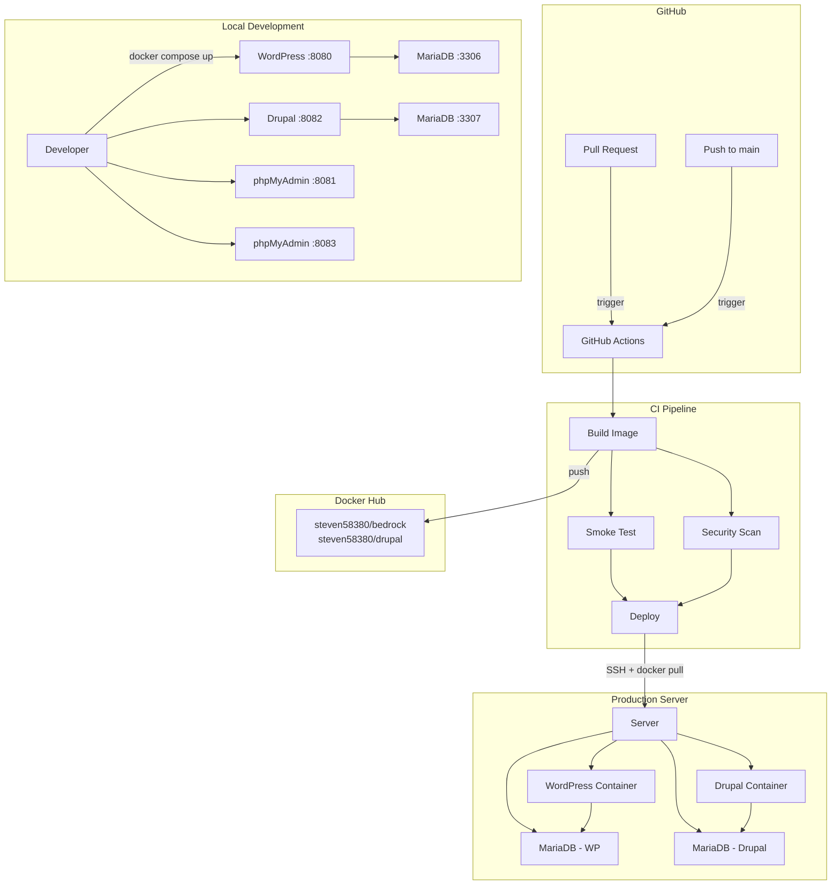

# Portfolio: Personal Dev Environment

> Containerized local development platform for WordPress (Bedrock) and Drupal with full CI/CD pipeline, security scanning, and automated deployment.

## Overview

This project demonstrates a production-grade DevOps setup for two CMS platforms running side by side with isolated databases, automated builds, vulnerability scanning, and zero-downtime deployment with rollback.

### Stack

| Layer | Technology |
|-------|-----------|
| **CMS** | WordPress 6.9 (Bedrock) / Drupal 11.3 |
| **Runtime** | PHP 8.3, Apache 2.4 |
| **Database** | MariaDB 11 |
| **Containerization** | Docker, Docker Compose |
| **CI/CD** | GitHub Actions (Buildx, Trivy, SSH deploy) |
| **Registry** | Docker Hub |
| **Package Manager** | Composer 2 |
| **CLI Tools** | WP-CLI, Drush 13 |
| **DB Admin** | phpMyAdmin |

---

## Capabilities

### Containerization & Local Development

Custom multi-stage Dockerfiles for both WordPress (Bedrock) and Drupal, built on `php:8.3-apache` with optimized layer caching. Composer dependencies are installed in a separate layer so rebuilds only rerun when `composer.json` changes.

Each project runs its own isolated stack (app + db + admin panel) with no port conflicts. Environment variables drive all configuration, following the 12-factor app methodology.

**Key details:**
- Port isolation between projects (WordPress: 8080/3306, Drupal: 8082/3307)
- Separated `DB_PORT` (internal) and `DB_EXTERNAL_PORT` (host mapping) to avoid dual-purpose env vars
- Health checks on database containers with dependency ordering (`service_healthy`)
- PHP tuned for CMS workloads: 256MB memory, 64MB uploads, 300s execution time

<!-- screenshot: docker-containers.png -->

### CI/CD Pipeline

Fully automated GitHub Actions pipeline triggered by path-scoped changes — WordPress and Drupal workflows run independently, only when their own files change.

```
Build Image  -->  Smoke Test      -->  Deploy
                  Security Scan        (only on push to main)
                  (parallel)
```

**Pipeline stages:**

1. **Build** — Docker Buildx with GitHub Actions cache (`type=gha`). Tags images with git SHA + `latest`. Pushes to Docker Hub only on merge to `main`; PR builds are load-only for testing.

2. **Smoke Test** — Spins up the full Docker Compose stack inside the CI runner and validates:
   - HTTP responses from app and phpMyAdmin
   - Database connectivity from within the app container
   - Required PHP extensions (gd, mysqli, pdo_mysql, zip, opcache, intl/exif)
   - Apache mod_rewrite enabled
   - CLI tool availability (WP-CLI / Drush)
   - Container health status

3. **Security Scan** — Trivy scans the built image for CRITICAL, HIGH, and MEDIUM vulnerabilities. Results are uploaded as artifacts and summarized with counts by severity.

4. **Deploy** — SSH into the production server, pull the new image, restart containers, verify HTTP response. Automatic rollback on failure.

<!-- screenshot: ci-pipeline.png -->

### Job Summaries

Every pipeline stage writes a rich GitHub Actions Job Summary with:
- Structured tables for build metadata, test results, and vulnerability counts
- Collapsible sections for full scan output and container logs on failure
- Clear pass/fail indicators per check

<!-- screenshot: job-summary-smoke.png -->
<!-- screenshot: job-summary-security.png -->

### Security

- **Trivy vulnerability scanning** on every build — catches CVEs in OS packages and application dependencies
- Results broken down by severity (Critical / High / Medium) with full details in collapsible output
- Scan artifacts uploaded for audit trail
- No secrets in images — all credentials passed via environment variables at runtime
- Docker Hub authentication only on push events (PRs don't need registry access)

<!-- screenshot: security-scan.png -->

### Automated Deployment & Rollback

The deploy job runs only after both smoke tests and security scan pass, creating a quality gate before production.

```
smoke-test ----\
                +--> deploy --> verify --> (rollback on failure)
security-scan -/
```

- Requires GitHub Environment (`production`) for optional approval gates
- SSH-based deployment using `appleboy/ssh-action`
- Post-deploy HTTP verification
- Automatic rollback to previous image if verification fails
- Image pruning after successful deploy

<!-- screenshot: deploy-summary.png -->

### Database Management

- MariaDB 11 with health checks (`healthcheck.sh --connect --innodb_initialized`)
- Named volumes for data persistence across container restarts
- phpMyAdmin for visual database management
- CLI access: `docker exec <container> mariadb -u <user> -p<pass>`
- Clean teardown: `docker compose down -v` removes volumes

### WordPress (Bedrock)

[Bedrock](https://roots.io/bedrock/) is a modern WordPress stack with:
- Composer-managed dependencies (WordPress core, plugins, themes)
- Environment-based configuration (`.env` files, not `wp-config.php` edits)
- Improved security: WordPress installed in a subdirectory (`/wp/`), separated content directory (`/app/`)
- WP-CLI for scriptable installation and management
- Support for development/production environment configs

### Drupal

- Drupal 11 with environment-aware `settings.php` (DB, hash salt, trusted hosts from env vars)
- Development mode auto-configured: CSS/JS aggregation off, render cache disabled
- Drush 13 for CLI site installation and management
- Config sync directory ready (`../config/sync`)
- Local settings override support (`settings.local.php`)

---

## Architecture



## Repository Structure

```
.
├── .github/
│   └── workflows/
│       ├── wordpress.yml        # WP build, test, scan, deploy
│       └── drupal.yml           # Drupal build, test, scan, deploy
├── wordpress/
│   ├── Dockerfile               # PHP 8.3 + Apache + Composer
│   ├── docker-compose.yml       # WP + MariaDB + phpMyAdmin
│   ├── .env.example             # Environment template
│   ├── composer.json            # Bedrock dependencies
│   ├── config/
│   │   ├── application.php      # Bedrock config (env-driven)
│   │   └── environments/        # Per-environment overrides
│   └── web/                     # Webroot (wp/ + app/)
├── drupal/
│   ├── Dockerfile               # PHP 8.3 + Apache + Composer + intl
│   ├── docker-compose.yml       # Drupal + MariaDB + phpMyAdmin
│   ├── .env.example             # Environment template
│   ├── composer.json            # Drupal dependencies
│   ├── load.environment.php     # Env loader
│   └── web/
│       └── sites/default/
│           └── settings.php     # Env-driven DB + cache config
├── docs/
│   └── portfolio.md             # This file
└── README.md                    # Setup & usage instructions
```

## Screenshots

> Replace placeholders with actual screenshots from your environment.

| Screenshot | Description |
|------------|-------------|
| <!-- screenshot: 01-wp-frontend.png --> | WordPress frontend with theme |
| <!-- screenshot: 02-wp-login.png --> | WordPress login page |
| <!-- screenshot: 03-drupal-installer.png --> | Drupal installation wizard |
| <!-- screenshot: 04-drupal-frontend.png --> | Drupal frontend after install |
| <!-- screenshot: 05-drupal-login.png --> | Drupal login page |
| <!-- screenshot: 06-phpmyadmin.png --> | phpMyAdmin database view |
| <!-- screenshot: 07-ci-pipeline.png --> | GitHub Actions pipeline overview |
| <!-- screenshot: 08-smoke-test-summary.png --> | Smoke test job summary |
| <!-- screenshot: 09-security-scan-summary.png --> | Security scan job summary |
| <!-- screenshot: 10-deploy-summary.png --> | Deploy job summary |

---


